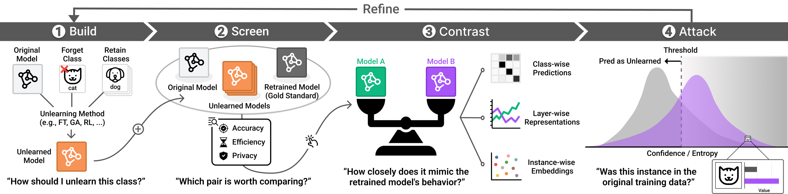
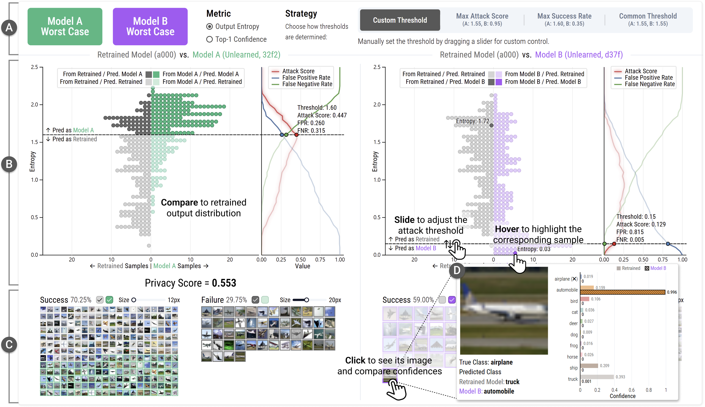

# 🧹 Machine Unlearning Comparator

[](https://youtu.be/yAyAYp2msDk?si=Q-8IgVlrk8uSBceu)
[](https://gnueaj.github.io/Machine-Unlearning-Comparator/)
[](https://arxiv.org/abs/2508.12730)
[](https://github.com/gnueaj/Machine-Unlearning-Comparator)

A web-based visual analytics system for the comparative evaluation of Machine Unlearning (MU) methods.


This system helps researchers systematically compare MU methods based on three core principles: **accuracy, efficiency, and privacy**. The workflow is structured into four stages: **Build → Screen → Contrast → Attack**.



## ✨ Key Features

* **Multi-Level Visual Comparison**
    * Analyze model behavior from class, instance, and layer-level perspectives.
    * Includes: `Class-wise Accuracy chart`, `Prediction Matrix`, `Embedding Space`, and `Layer-wise Similarity chart`.

* **Interactive Privacy Audits**
    * Simulate **Membership Inference Attacks (MIAs)** to verify data removal.



---

## 🔧 Built-in Methods

| Method | Description |
| :--- | :--- |
| **Fine-Tuning (FT)** | Fine-tunes the model only on the **retain set**. |
| **Gradient Ascent (GA)** | Adjusts model parameters to **maximize loss** on the forget set. |
| **Random Labeling (RL)** | Assigns **random labels** to the forget set and then fine-tunes the model. |
| **SCRUB** | Uses a **teacher-student distillation** framework to maximize loss on the forget set while minimizing it on the retain set. |
| **SalUn** | **Masks weights** influenced by the forget set before applying random labeling and targeted fine-tuning. |

---

## 🔌 Add Your Own Method

Implement and register your own MU methods via a Python hook for direct comparison within the system.

💡 **Tip**: Ask [Claude Code](https://claude.ai/code) for a boilerplate template to get started quickly!

---

## ⚡ Quick Start

### Backend
```bash
# 1. Install deps & activate environment
hatch shell
# 2. Run the API server
hatch run start
```

### Frontend
```bash
# 1 Install deps
pnpm install
# 2 Launch the UI
pnpm start
```

---

## ⚙️ Configuration

### UMAP Embedding Space

Adjust UMAP parameters for `Embedding Space` visualization in [backend/app/config/settings.py](backend/app/config/settings.py):

- `UMAP_N_NEIGHBORS`: Lower (5-10) for local clusters, higher (11-20) for global structure
- `UMAP_MIN_DIST`: Lower (0.1-0.3) for tighter clusters, higher (0.5-0.9) for even spacing

---

## Related Resources
- **ResNet-18 CIFAR-10 MU checkpoints** → <https://huggingface.co/jaeunglee/resnet18-cifar10-unlearning>
- **ResNet-18 FashionMNIST MU checkpoints** → <https://huggingface.co/Yurim0507/resnet18-fashionmnist-unlearning>
- **ViT-Base CIFAR-10 MU checkpoints** → <https://huggingface.co/Yurim0507/vit-base-16-cifar10-unlearning>

---

## 📚 Citation

If you use this tool in your research, please cite our paper:

```bibtex
@misc{lee2025unlearning,
  title = {{Unlearning Comparator:} A Visual Analytics System for Comparative Evaluation of Machine Unlearning Methods},
  author = {Jaeung Lee and Suhyeon Yu and Yurim Jang and Simon S. Woo and Jaemin Jo},
  year   = {2025},
  note   = {arXiv:2508.12730},
  url    = {https://arxiv.org/abs/2508.12730}
}
```


